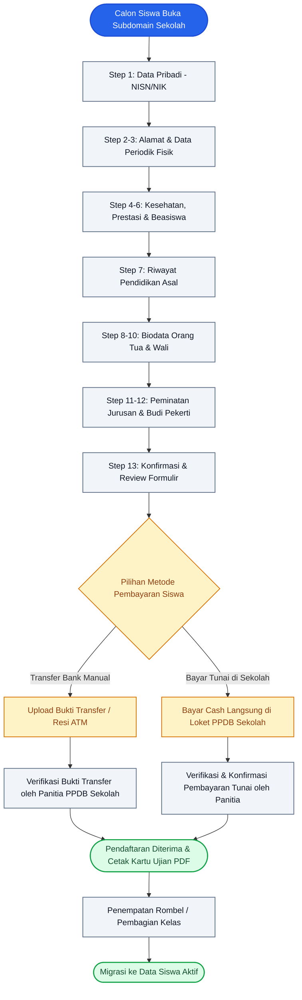
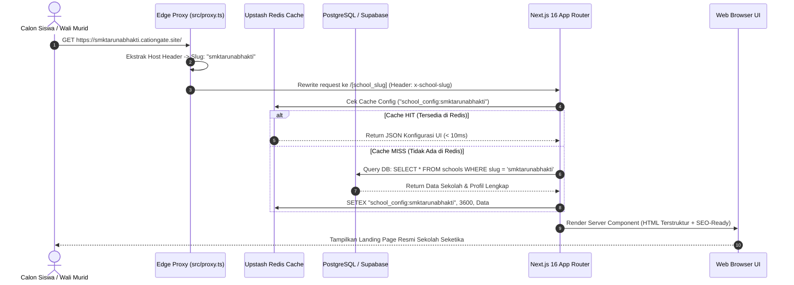
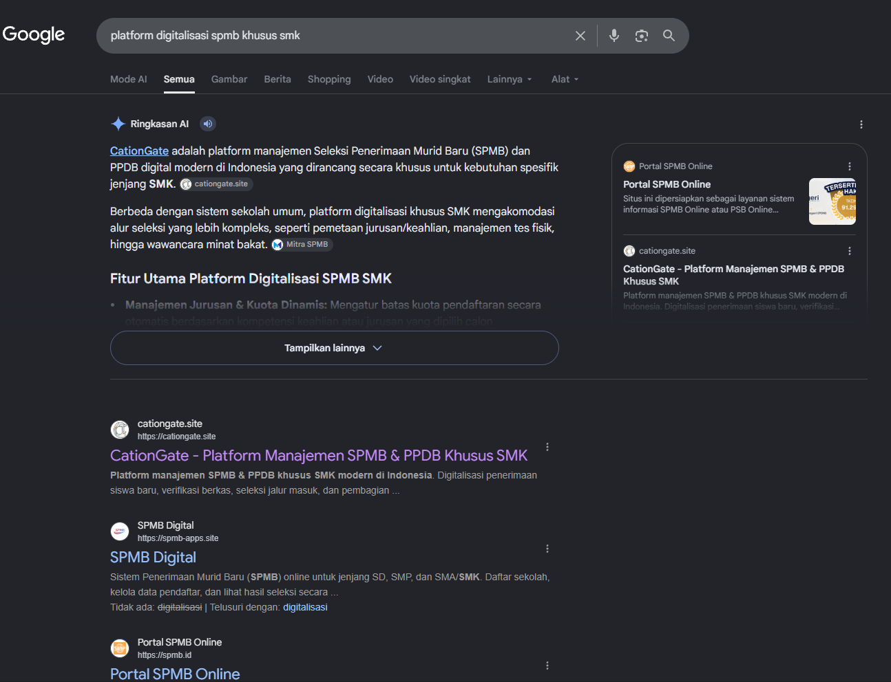
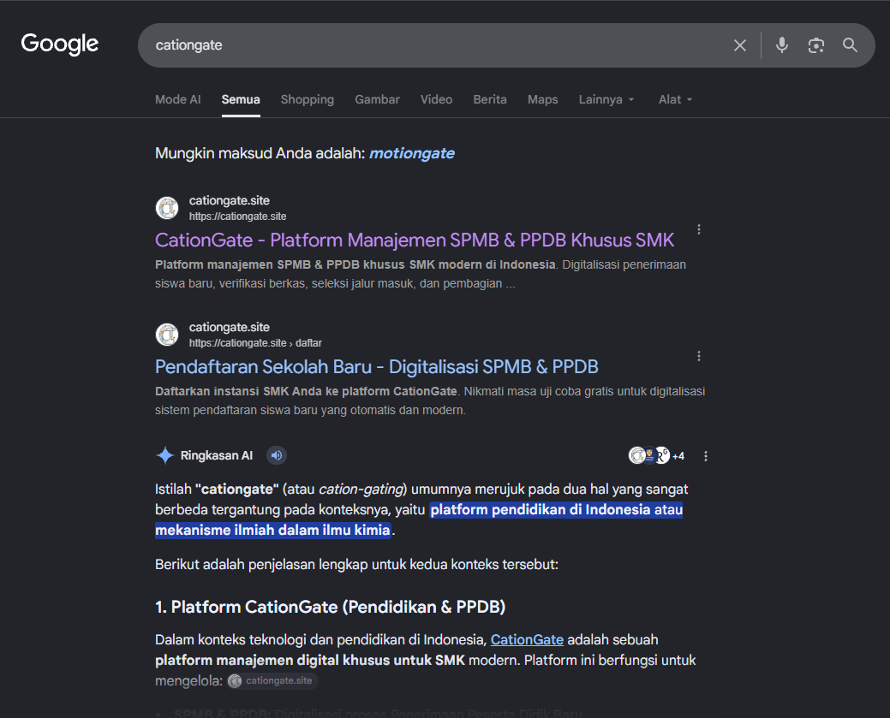

<p align="center">
  
</p>

# CationGate — Enterprise Multi-Tenant SPMB & School Management SaaS Platform

> **CationGate** adalah platform Software-as-a-Service (SaaS) Multi-Tenant modern untuk sistem Penerimaan Peserta Didik Baru (PPDB/SPMB) dan administrasi sekolah digital di Indonesia. Mendukung routing subdomain dinamis (`https://[school_slug].cationgate.site`), kustomisasi landing page sekolah secara mandiri, formulir pendaftaran 14 langkah, verifikasi berkas otomatis, pembagian rombongan belajar (rombel), hingga portal superadmin pusat (**Gatekeeper**).

**Akses langsung via browser**: [https://cationgate.site](https://cationgate.site)

<p align="center">
  <a href="https://cationgate.site"></a>
  <a href="#"></a>
  <a href="#"></a>
  <a href="#"></a>
  <a href="#"></a>
  <a href="#"></a>
</p>

---

## 📑 Daftar Isi
1. [Fitur Utama & Modul Sistem](#fitur-utama--modul-sistem)
2. [Peta Arsitektur Sistem (Archify System Maps)](#-peta-arsitektur-sistem-archify-system-maps)
   - [1. Peta Topologi & Arsitektur Global (Architecture Map)](#1-peta-topologi--arsitektur-global-architecture-map)
   - [2. Alur Pendaftaran Siswa 14 Langkah (Workflow Diagram)](#2-alur-pendaftaran-siswa-14-langkah-workflow-diagram)
   - [3. Resolusi Subdomain & Caching Fallback (Sequence Diagram)](#3-resolusi-subdomain--caching-fallback-sequence-diagram)
   - [4. Mesin Status & Alur Data Siswa (Data Flow Diagram)](#4-mesin-status--alur-data-siswa-data-flow-diagram)
   - [5. Siklus Hidup Akun Sekolah & SaaS (Lifecycle Diagram)](#5-siklus-hidup-akun-sekolah--saas-lifecycle-diagram)
3. [Penjelasan Seluruh Struktur Kode (Codebase Deep Dive)](#-penjelasan-seluruh-struktur-kode-codebase-deep-dive)
   - [A. Lapisan Routing & Edge Proxy (`src/proxy.ts` & `src/app`)](#a-lapisan-routing--edge-proxy-srcproxyts--srcapp)
   - [B. Lapisan Backend & API Engine (`src/server`)](#b-lapisan-backend--api-engine-srcserver)
   - [C. Lapisan Database & Resolver (`src/server/db`)](#c-lapisan-database--resolver-srcserverdb)
   - [D. State Management & Hooks (`src/stores` & `src/hooks`)](#d-state-management--hooks-srcstores--srchooks)
   - [E. Desain UI & Komponen (`src/components`)](#e-desain-ui--komponen-srccomponents)
4. [Tech Stack & Arsitektur Sistem](#tech-stack--arsitektur-sistem)
5. [Hak Akses & Kredensial Pengujian (Testing Accounts)](#hak-akses--kredensial-pengujian-testing-accounts)
6. [Struktur Direktori Proyek](#struktur-direktori-proyek)
7. [Panduan Menjalankan Project (Local Development)](#panduan-menjalankan-project-local-development)
8. [SEO & Performa](#seo--performa)
9. [Kebijakan Keamanan & Multi-Tenancy](#kebijakan-keamanan--multi-tenancy)

---

## Fitur Utama & Modul Sistem

### 1. Multi-Tenant Subdomain & Dynamic Landing Page
* **Subdomain Otomatis**: Setiap sekolah memiliki landing page & portal independen (contoh: `smktarunabhakti.cationgate.site`, `smpsegarcimanggis.cationgate.site`).
* **Kelola UI/Data**: Admin sekolah dapat mengubah judul, logo, hero banner, alur pendaftaran, program keahlian (jurusan), FAQ, rekening bank, dan profil pimpinan secara real-time.
* **Multi-Tenant Data Isolation**: Seluruh data siswa, pengumuman, dan konfigurasi terisolasi 100% menggunakan identitas UUID sekolah (`school_id`).

### 2. Formulir Pendaftaran Online 14 Langkah (PPDB Wizard)
* **14 Langkah Terpadu**:
  1. Data Pribadi Calon Siswa (NISN, NIK, Nama Lengkap)
  2. Data Tempat Tinggal & Koordinat Lokasi
  3. Data Periodik Siswa (Tinggi, Berat, Jarak ke Sekolah)
  4. Riwayat Kesehatan
  5. Prestasi Akademik & Non-Akademik
  6. Data Beasiswa (KIP, PKH, PIP)
  7. Riwayat Pendidikan Asal Sekolah (SMP/MTs)
  8. Data Ayah Kandung
  9. Data Ibu Kandung
  10. Data Wali Murid
  11. Minat & Bakat Kejuruan
  12. Penilaian Budi Pekerti
  13. Review & Konfirmasi Formulir
  14. Pembayaran
* **Invoice & Pembayaran Siswa**: Pembayaran biaya pendaftaran siswa dilakukan secara fleksibel melalui **Transfer Bank Manual** (upload bukti transfer/resi) atau **Bayar Tunai/Cash** langsung di loket pendaftaran sekolah yang diverifikasi langsung oleh panitia PPDB.
* **Auto-Draft & Hydration**: Progres input siswa tersimpan otomatis di browser (`localStorage`) sehingga tidak hilang jika koneksi terputus.

### 3. Dashboard Admin Sekolah
* **Manajemen Calon Siswa**: Verifikasi berkas, persetujuan (*approve*), penolakan (*reject*) dengan alasan, konfirmasi bukti transfer/pembayaran cash, serta unduh rekap data Excel/PDF.
* **Kontrol Pendaftaran Publik**: Saklar Buka/Tutup (*Open/Closed*) gelombang pendaftaran secara instan.
* **Pembagian Kelas / Rombel**: Pengelompokan siswa baru ke dalam rombel secara otomatis atau manual.
* **Kelola Informasi & Forum**: Publikasi artikel, pengumuman berkas PDF/Video/Foto resmi sekolah.
* **Profil & Identitas Sekolah**: Manajemen sejarah, visi misi, legalitas NPSN, dan pimpinan sekolah.

### 4. Portal Pusat Superadmin: Gatekeeper
* **Verifikasi Legalitas Sekolah**: Menyetujui atau menolak pendaftaran sekolah baru berdasarkan SK Izin Operasional dan data pokok NPSN.
* **Manajemen Berlangganan (SaaS Subscription)**: Monitoring paket aktif (Starter, Pro, Enterprise), mutasi transaksi langganan sekolah via Midtrans, dan invoice.
* **System Telemetry & Security**: Monitoring kesehatan database, status cache Redis, audit log per aksi, hingga saklar *Maintenance Mode* global.
* **Telegram Bot Notifier**: Notifikasi otomatis ke tim superadmin untuk setiap login gatekeeper dan aktivitas penting.

---

## 🗺️ Peta Arsitektur Sistem (Archify System Maps)

Berikut adalah visualisasi arsitektur sistem CationGate mengadopsi standar diagram arsitektur **[Archify](https://github.com/tt-a1i/archify)** (*Architecture, Workflow, Sequence, Data Flow,* dan *Lifecycle Maps*).

### 1. Peta Topologi & Arsitektur Global (Architecture Map)

Diagram ini menggambarkan interaksi dari peramban pengguna, *Edge Ingress*, Server Next.js, API Gateway Hono, hingga basis data dan integrasi pihak ketiga:

```
┌─────────────────────────────────────────────────────────────────────────────────────────────┐
│                                 EDGE INGRESS & ROUTING LAYER                                │
│                                                                                             │
│   [ Client Browser ] ─── HTTPS ───► [ Cloudflare / DNS ] ───► [ Next.js Middleware/Proxy ]  │
│                                                                (src/proxy.ts)               │
│                                                                       │                     │
│               ┌───────────────────────────────────────────────────────┴──────────────┐      │
│               ▼ Subdomain Tenant Route                        ▼ Root Platform Route  │      │
│       [ *.cationgate.site ]                                   [ cationgate.site ]    │      │
│       - Landing Page Sekolah                                  - Platform Landing     │      │
│       - PPDB 14-Step Wizard                                   - Gatekeeper Portal    │      │
│       - Portal Admin Sekolah                                  - SaaS Registration    │      │
└───────────────────────────────────────┬─────────────────────────────────────────────────────┘
                                        │
┌───────────────────────────────────────▼─────────────────────────────────────────────────────┐
│                           PRESENTATION & SSR LAYER (Next.js 16)                             │
│                                                                                             │
│  ┌───────────────────────────┐ ┌───────────────────────────┐ ┌───────────────────────────┐  │
│  │   App Router (SSR/RSC)    │ │    Zustand Store Engine   │ │     UI Design System      │  │
│  │  - src/app/[school_slug]  │ │  - usePPDBStore (14 Step) │ │  - Tailwind CSS           │  │
│  │  - src/app/gatekeeper     │ │  - useAuthStore (Session) │ │  - Radix UI & Lucide      │  │
│  │  - src/app/(auth)         │ │  - useSchoolStore (Config)│ │  - Anti-AI Slop Standards │  │
│  └───────────────────────────┘ └───────────────────────────┘ └───────────────────────────┘  │
└───────────────────────────────────────┬─────────────────────────────────────────────────────┘
                                        │ Internal Fetch / REST API
┌───────────────────────────────────────▼─────────────────────────────────────────────────────┐
│                          HONO API GATEWAY & BUSINESS ENGINE                                 │
│                                    (src/server/index.ts)                                    │
│                                                                                             │
│  [ Middleware Pipeline ]:                                                                   │
│  ├── CORS Whitelist & Origin Inspector                                                      │
│  ├── Secure Headers (HSTS, CSP, X-Frame SAMEORIGIN, X-XSS)                                  │
│  ├── JWT Authenticator & Role Authorizer (Bearer Token)                                     │
│  └── Tenant Context Injector (resolveSchoolUUID / Subdomain Scoping)                        │
│                                                                                             │
│  ┌──────────────────────────────────────────────────────────────────────────────────────┐   │
│  │ API Handlers & Domain Routes (/api/*):                                               │   │
│  │ ├── /auth            : Multi-role authentication & OTP recovery                      │   │
│  │ ├── /applicants      : 14-step student registration & document verification          │   │
│  │ ├── /config          : Landing page UI builder & school master data                  │   │
│  │ ├── /chatbot         : AI knowledge retrieval & natural language responses           │   │
│  │ ├── /gatekeeper      : SaaS subscriptions, school verifications & platform telemetry │   │
│  │ ├── /payment         : Midtrans Snap Token (SaaS Subscription Sekolah) & Invoice     │   │
│  │ ├── /siswa-aktif     : Class distribution (rombel) & student archive migration       │   │
│  │ └── /storage         : Cloud document uploads, receipt proofs & image compression    │   │
│  └──────────────────────────────────────────────────────────────────────────────────────┘   │
└───────────────────────────────────────┬─────────────────────────────────────────────────────┘
                                        │
┌───────────────────────────────────────▼─────────────────────────────────────────────────────┐
│                              PERSISTENCE & EXTERNAL INTEGRATIONS                            │
│                                                                                             │
│   ┌──────────────────────────┐  ┌──────────────────────────┐  ┌──────────────────────────┐  │
│   │   Supabase PostgreSQL    │  │    Upstash Redis Cache   │  │   Third-Party Services   │  │
│   │  - Row Level Security    │  │  - School UI Caching     │  │  - Midtrans (SaaS Pay)   │  │
│   │  - Multi-Tenant UUID     │  │  - Rate Limit Tokens     │  │  - Telegram Bot API      │  │
│   │  - Pooler Connection     │  │  - Fast Read Latency     │  │  - Resend / Nodemailer   │  │
│   └──────────────────────────┘  └──────────────────────────┘  └──────────────────────────┘  │
└─────────────────────────────────────────────────────────────────────────────────────────────┘
```

---

### 2. Alur Pendaftaran Siswa 14 Langkah (Workflow Diagram)

Diagram ini merinci tahapan pengisian formulir terpadu hingga verifikasi pembayaran manual/tunai dan pencetakan kartu tanda bukti pendaftaran:



---

### 3. Resolusi Subdomain & Caching Fallback (Sequence Diagram)

Diagram berikut menjelaskan bagaimana request subdomain sekolah diproses menggunakan Redis cache sebelum fallback ke database utama:



---

### 4. Mesin Status & Alur Data Siswa (Data Flow Diagram)

Setiap entri calon siswa memiliki transisi status (*state machine*) yang terstruktur:

```
┌──────────────┐     Input Form 14 Step      ┌───────────────┐
│  FORM DRAFT  │ ──────────────────────────► │   SUBMITTED   │
└──────────────┘                             └───────┬───────┘
                                                     │
                                                     ▼
                                             ┌───────────────┐
                                             │PAYMENT PENDING│
                                             └───────┬───────┘
                                                     │
                             ┌───────────────────────┴───────────────────────┐
                             ▼ (Upload Bukti / Bayar Tunai di Loket)          ▼ (Batal / Tidak Valid)
                     ┌───────────────┐                               ┌───────────────┐
                     │ PAYMENT PAID  │                               │PAYMENT EXPIRED│
                     └───────┬───────┘                               └───────────────┘
                             │
                             ▼
                     ┌───────────────┐
                     │VERIFY PENDING │ (Audit Berkas Ijazah, KK, Akta)
                     └───────┬───────┘
                             │
             ┌───────────────┴───────────────┐
             ▼ (Syarat Terpenuhi)            ▼ (Berkas Tidak Valid)
     ┌───────────────┐               ┌───────────────┐
     │   APPROVED    │               │   REJECTED    │
     └───────┬───────┘               └───────────────┘
             │
             ▼
     ┌───────────────┐
     │CLASS ALLOCATED│ (Pembagian Rombel Jurusan)
     └───────┬───────┘
             │
             ▼
     ┌───────────────┐
     │ ACTIVE STUDENT│ (Masuk Database Induk Siswa Aktif)
     └───────────────┘
```

---

### 5. Siklus Hidup Akun Sekolah & SaaS (Lifecycle Diagram)

```
 [ Calon Sekolah Mendaftar ]
             │
             ▼
 [ Prospective School (Pending Audit) ]
             │
             ▼
 [ Superadmin Gatekeeper Verifikasi SK & NPSN ]
             ├─── DITOLAK ──► [ Notifikasi Alasan Penolakan via Email ]
             └─── DISETUJUI ──┐
                              ▼
     [ Akun Aktif: 30-Day Free Trial ]
                              │
                              ├─── Berlangganan Paket Premium SaaS Sekolah (Starter / Pro / Enterprise)
                              │        │
                              │        ▼ (Pembayaran Otomatis via Midtrans: QRIS / VA / E-Wallet)
                              │    [ Active Subscription (Fitur Penuh & Kuota Siswa Terbuka) ]
                              │        │
                              │        ▼
                              └─── Masa Trial / Paket Habis
                                       │
                                       ▼
                                   [ Grace Period (Akses Terbatas) ]
                                       │
                                       ▼
                                   [ Suspended / Archived ]
```

---

## 🔍 Penjelasan Seluruh Struktur Kode (Codebase Deep Dive)

Berikut adalah panduan lengkap setiap modul dan file penting dalam proyek CationGate:

### A. Lapisan Routing & Edge Proxy (`src/proxy.ts` & `src/app`)

#### 1. [`src/proxy.ts`](file:///d:/Website%20Project/CationGate/src/proxy.ts) — Dynamic Edge Subdomain Router
* **Fungsi Utama**: Bertindak sebagai reverse-proxy dan router terdepan sebelum server Next.js memproses request.
* **Fitur Kunci**:
  * **Deteksi Host & Subdomain**: Membaca header `host` untuk memisahkan domain utama `cationgate.site` dengan subdomain sekolah `[school_slug].cationgate.site`.
  * **Bot & Audit Shield**: Memblokir automated crawler / bot pemindai performa (Lighthouse, GTmetrix, PageSpeed) pada rute dinamis agar beban server tetap stabil.
  * **System Reserved Filter**: Mencegah tabrakan nama subdomain sistem (`api`, `admin`, `dashboard`, `auth`, `daftar`) dan mengarahkannya kembali ke portal yang tepat.
  * **Smart Rewrite**: Me-rewrite request URL subdomain ke internal route `/[school_slug]` tanpa mengubah URL pada browser pengguna.

---

#### 2. [`src/app/[school_slug]`](file:///d:/Website%20Project/CationGate/src/app/%5Bschool_slug%5D) — Dynamic School Tenant Portal
* **`page.tsx`**: Landing page resmi sekolah (Server-Side Rendered) yang memuat hero banner, sambutan, program keahlian (jurusan), alur PPDB, biaya, testimoni, dan FAQ.
* **`profil/`**: Profil lengkap sekolah, sejarah, visi & misi, struktur dewan guru, dan pimpinan instansi.
* **`forum/` & `blog/`**: Portal pengumuman resmi dan artikel edukasi sekolah.
* **`daftar/`**: Wizard pendaftaran online 14 langkah berstandar Dapodik.
* **`status/` & `data-pendaftar/`**: Pengecekan mandiri status kelulusan berkas calon siswa menggunakan NISN/NIK.
* **`kartu-pendaftaran/` & `invoice/`**: Cetak kartu tanda peserta ujian (PDF) dan invoice tagihan pendaftaran siswa (Transfer manual / Cash).
* **`dashboard/`**: Panel kendali lengkap bagi staf & admin sekolah:
  * `kelola-ui/`: No-code visual editor untuk mengatur tata letak, warna, dan konten landing page.
  * `profil-sekolah/`: Manajemen informasi legalitas NPSN, alamat, koordinat peta, dan profil pimpinan.
  * `pendaftar/` & `verifikasi-berkas/`: Tabel manajemen verifikasi berkas pendaftar & konfirmasi bukti transfer/cash (Setujui / Tolak dengan catatan).
  * `pembagian-kelas/`: Fitur penempatan rombel kelas siswa baru secara otomatis maupun manual.
  * `siswa-aktif/`: Arsip master database siswa yang telah aktif bersekolah.
  * `jalur-pendaftaran/` & `kuota/`: Pengaturan gelombang dan kuota penerimaan per jurusan.
  * `subscription/`: Dasbor pemantauan status paket SaaS sekolah ke CationGate pusat.

---

#### 3. [`src/app/gatekeeper`](file:///d:/Website%20Project/CationGate/src/app/gatekeeper) — Superadmin Platform Portal
* **`login/`**: Otentikasi superadmin dengan proteksi brute-force, audit log IP, dan notifikasi Telegram Bot instan.
* **`dashboard/`**:
  * **Schools Overview**: Verifikasi SK izin operasional dan legalitas sekolah pendaftar baru.
  * **Billing & Plans**: Monitoring transaksi mutasi paket langganan SaaS via Midtrans (Starter, Pro, Enterprise).
  * **System Telemetry**: Monitoring latensi database PostgreSQL, kesehatan memori Redis, dan throughput request API.

---

### B. Lapisan Backend & API Engine (`src/server`)

Seluruh business logic backend ditenagai oleh **Hono Framework Monolith API** yang di-mount pada Next.js API Routes (`/api/*`).

#### 1. [`src/server/index.ts`](file:///d:/Website%20Project/CationGate/src/server/index.ts) — API Entrypoint & Security Pipeline
* Mengatur CORS dinamis untuk seluruh subdomain `.cationgate.site` dan `localhost`.
* Menerapkan `secureHeaders` (Strict-Transport-Security, CSP, X-Frame-Options `SAMEORIGIN`, X-XSS Protection).
* Menjalankan `systemLogger` terpadu yang menyaring (*redact*) token sensitif dan mencatat durasi latensi eksekusi dalam milidetik (ms).

---

#### 2. Rute API Domain ([`src/server/routes/`](file:///d:/Website%20Project/CationGate/src/server/routes))

| Nama File Route | Endpoint Basis | Deskripsi Fungsionalitas |
| :--- | :--- | :--- |
| **[`auth.ts`](file:///d:/Website%20Project/CationGate/src/server/routes/auth.ts)** | `/api/auth` | Login multi-role (Gatekeeper, Admin Sekolah, Siswa), registrasi sekolah baru, reset password, dan penerbitan JWT cookie. |
| **[`applicants.ts`](file:///d:/Website%20Project/CationGate/src/server/routes/applicants.ts)** | `/api/applicants` | CRUD pendaftaran siswa 14-langkah, verifikasi kelulusan berkas & pembayaran manual/cash, export Excel/PDF, dan status tracking. |
| **[`config.ts`](file:///d:/Website%20Project/CationGate/src/server/routes/config.ts)** | `/api/config` | Pengambilan & pembaruan data landing page dinamis, jurusan, FAQ, alur, rekening sekolah, dan sinkronisasi cache Redis. |
| **[`chatbot.ts`](file:///d:/Website%20Project/CationGate/src/server/routes/chatbot.ts)** | `/api/chatbot` | Layanan tanya-jawab AI interaktif untuk calon siswa berdasarkan profil dan aturan sekolah. |
| **[`gatekeeper.ts`](file:///d:/Website%20Project/CationGate/src/server/routes/gatekeeper.ts)** | `/api/gatekeeper` | Audit platform, approval sekolah, monitoring log sistem, pengaturan kuota global, dan telemetri server. |
| **[`saas.ts`](file:///d:/Website%20Project/CationGate/src/server/routes/saas.ts)** | `/api/saas` | Pengelolaan tier berlangganan, pembatasan kuota siswa per tier, dan riwayat faktur tagihan sekolah. |
| **[`payment.ts`](file:///d:/Website%20Project/CationGate/src/server/routes/payment.ts)** | `/api/payment` | Integrasi Payment Gateway Midtrans (Snap Token & Webhook) untuk pembayaran paket SaaS premium sekolah serta pencatatan invoice. |
| **[`siswa-aktif.ts`](file:///d:/Website%20Project/CationGate/src/server/routes/siswa-aktif.ts)** | `/api/siswa-aktif` | Manajemen rombongan belajar (rombel), mutasi siswa, dan pencatatan NIS/NISN aktif. |
| **[`storage.ts`](file:///d:/Website%20Project/CationGate/src/server/routes/storage.ts)** | `/api/storage` | Upload dokumen aman (Ijazah, KK, Akta, Pas Foto, Bukti Transfer) ke Supabase Storage Bucket. |
| **[`informasi.ts`](file:///d:/Website%20Project/CationGate/src/server/routes/informasi.ts)** | `/api/informasi` | Publikasi artikel pengumuman, berita sekolah, dan lampiran PDF publik. |
| **[`school-profile.ts`](file:///d:/Website%20Project/CationGate/src/server/routes/school-profile.ts)** | `/api/school-profile`| Manajemen data pimpinan sekolah, struktur organisasi, dan sejarah instansi. |
| **[`kuota.ts`](file:///d:/Website%20Project/CationGate/src/server/routes/kuota.ts)** | `/api/kuota` | Konfigurasi kuota per jurusan dan pemantauan sisa kapasitas pendaftar secara realtime. |
| **[`mailer.ts`](file:///d:/Website%20Project/CationGate/src/server/routes/mailer.ts)** | `/api/mailer` | Layanan pengiriman email konfirmasi pendaftaran, invoice, dan aktivasi akun via SMTP/Resend. |

---

#### 3. Services & Domain Logic ([`src/server/services/`](file:///d:/Website%20Project/CationGate/src/server/services))
* **[`ApplicantService.ts`](file:///d:/Website%20Project/CationGate/src/server/services/ApplicantService.ts)**: Validasi skema pendaftaran 14 langkah dan perhitungan jarak koordinat (geolokasi zonasi).
* **[`SaasService.ts`](file:///d:/Website%20Project/CationGate/src/server/services/SaasService.ts)**: Menghitung pembatasan kuota pendaftar berdasarkan paket aktif sekolah (Starter: 100 siswa, Pro: 500 siswa, Enterprise: Unlimited).
* **[`EmailService.ts`](file:///d:/Website%20Project/CationGate/src/server/services/EmailService.ts)**: Template HTML email responsif untuk kartu bukti pendaftaran dan pemberitahuan kelulusan.
* **[`ApplicantExportService.ts`](file:///d:/Website%20Project/CationGate/src/server/services/ApplicantExportService.ts)**: Utilitas eksportir rekapitulasi data pendaftar ke format Spreadsheet (Excel) dan cetak berkas PDF massal.

---

### C. Lapisan Database & Resolver (`src/server/db`)

* **[`resolve-school.ts`](file:///d:/Website%20Project/CationGate/src/server/db/resolve-school.ts)**: Inti resolusi multi-tenant. Mengonversi subdomain/slug menjadi identitas `school_id` UUID resmi yang mengunci seluruh kueri database.
* **[`client.ts`](file:///d:/Website%20Project/CationGate/src/server/db/client.ts)**: Pooler koneksi PostgreSQL native berkecepatan tinggi untuk kueri analitik dan transaksi intensif.
* **[`supabase.ts`](file:///d:/Website%20Project/CationGate/src/server/db/supabase.ts)**: Client Supabase dengan Service Role Key untuk operasi Row Level Security terpusat.
* **[`redis.ts`](file:///d:/Website%20Project/CationGate/src/server/db/redis.ts)**: Wrapper Upstash Redis REST Client untuk penyimpanan sesi sementara dan cache respon landing page.

---

### D. State Management & Hooks (`src/stores` & `src/hooks`)

* **[`usePPDBStore.ts`](file:///d:/Website%20Project/CationGate/src/stores/usePPDBStore.ts)**: Store Zustand utama yang menyimpan seluruh data 14 langkah formulir pendaftaran di browser `localStorage` (auto-draft).
* **[`useAuthStore.ts`](file:///d:/Website%20Project/CationGate/src/stores/useAuthStore.ts)**: Manajemen status sesi login pengguna, token JWT, dan peran (*Superadmin, School Admin, Operator*).
* **[`useSchoolStore.ts`](file:///d:/Website%20Project/CationGate/src/stores/useSchoolStore.ts)**: Menyimpan konfigurasi aktif sekolah (nama, logo, tema warna, gelombang pendaftaran).
* **[`useSchoolHref.ts`](file:///d:/Website%20Project/CationGate/src/hooks/useSchoolHref.ts)**: Helper navigasi URL subdomain secara dinamis baik pada lingkungan produksi maupun localhost.

---

### E. Desain UI & Komponen (`src/components`)

Dibangun dengan mematuhi **Anti-AI Slop Standards** dan **Clean B2B Enterprise UI (Stripe / Vercel style)**:
* **`components/ui/`**: Primitif UI berbasis `shadcn/ui` & Radix UI (Button, Dialog, Dropdown, Table, Accordion, Badge, Tooltip).
* **`components/landing/`**: Komponen modular landing page sekolah (Hero Section, Jurusan Showcase, Alur Pendaftaran, FAQ Accordion, Testimoni).
* **`components/features/`**: Komponen interaktif khusus seperti Chatbot AI Widget, Floating CTA, Upload Bukti Transfer Dropzone, dan PDF Registration Card Preview.

---

## Tech Stack & Arsitektur Sistem

| Kategori | Teknologi | Deskripsi |
| :--- | :--- | :--- |
| **Frontend Framework** | **Next.js 16 (App Router)** | Server Components, Server-Side Rendering (SSR), API route handlers |
| **UI Library** | **React 19 & TypeScript** | Strict type-safety dan komponen reaktif modern |
| **Styling & Icons** | **Tailwind CSS & Lucide Icons** | Desain B2B Enterprise clean (Stripe/Vercel style), dark/light mode |
| **Component Kit** | **shadcn/ui & Radix UI** | Komponen aksesibel (Dialog, Dropdown, Accordion, Tooltip) |
| **Backend & Routing** | **Hono Framework** | Routing API berkecepatan tinggi pada edge/node handler |
| **Database** | **PostgreSQL & Supabase** | Relational DB dengan Row Level Security (RLS) policies aktif |
| **Caching Layer** | **Upstash Redis** | Caching konfigurasi landing page untuk performa loading instan |
| **Security & Auth** | **JWT & Bcrypt** | Autentikasi terenkripsi dengan rate limiter (`authLimiter`) |
| **Security Scanner** | **Snyk Code Analysis** | 0 Vulnerabilities terverifikasi pada codebase |
| **Payment Gateway** | **Midtrans** | Pembayaran otomatis paket langganan SaaS premium sekolah (QRIS, Virtual Account, & E-Wallet) |
| **Notifications** | **Telegram Bot API & Resend** | Notifikasi real-time via Telegram dan email transaksional |

---

## Hak Akses & Kredensial Pengujian (Testing Accounts)

### 1. Akun Superadmin Platform (Gatekeeper)
Akses URL: `https://cationgate.site/gatekeeper/login` (atau `http://localhost:3000/gatekeeper/login`)

| Username | Email | Role | Catatan |
| :--- | :--- | :--- | :--- |
| `algi` | `algi@cationgate.id` | Platform Superadmin | Founder & Core Platform Admin |
| `farel` | `farel@cationgate.id` | Gatekeeper Admin | Verification & Operations Admin |
| `jepan` | `jepan@cationgate.id` | Gatekeeper Admin | Verification & Operations Admin |
| `husein` | `husein@cationgate.id` | Gatekeeper Admin | Verification & Operations Admin |
| `uno` | `uno@cationgate.id` | Gatekeeper Admin | Platform Security Monitor |

Semua akun diatas pwnya : cihuahua123 (untuk approve verifikasi sekolah) 
Kalau mau denger notif login gatekeeper untuk mantau siapa yang login bisa masuk channel TELEGRAM ini https://t.me/+My3xvcqZM6cyYTVl
---

### 2. Akun Khusus Pengujian Keamanan & QA (Pentester Account)
Akun ini disediakan khusus untuk keperluan **Security Audit, QA Testing, dan Penetration Testing**:

* **Login URL**: `/gatekeeper/login`
* **Username**: `pentester` *(atau `gatekeeper_test`)*
* **Email**: `pentester@cationgate.id`
* **Password**: `CationGate2026!` *(atau `cihuahua123`)*
* **Scope Akses**: Akses penuh ke Gatekeeper Dashboard untuk menguji endpoint verifikasi sekolah, audit log, manajemen transaksi langganan SaaS, dan monitoring multi-tenant.

---

### 3. Akun Admin Sekolah (Tenant Admin)
Akses URL Subdomain: `https://[school_slug].cationgate.site/login` (atau di lokal `http://[school_slug].localhost:3000/login`)

* **Demo Tenant (SMK Demo Indonesia)**:
  * URL Subdomain: `https://demo.cationgate.site` (atau `http://demo.localhost:3000`)
  * Dashboard: `https://demo.cationgate.site/dashboard` (atau `http://demo.localhost:3000/dashboard`)
  * Sifat: Bebas uji coba, data tersimpan di sesi browser lokal.
* **Instansi Resmi (SMK Taruna Bhakti)**:
  * URL Subdomain: `https://namasekolah.cationgate.site` (atau `http://namasekolah.localhost:3000`)
  * Login Admin: `https://namasekolah.cationgate.site/login` (atau `http://namasekolah.localhost:3000/login`)
  * Email: `admin@namasekolah.sch.id` *(atau email yang didaftarkan saat registrasi)*
  * Password: `password123` *(atau `admin123`)*

---

## Struktur Direktori Proyek

```text
CationGate/
├── src/
│   ├── app/                               # Next.js App Router Pages
│   │   ├── (auth)/                        # Authentication Pages (Login, Register, Forgot Password)
│   │   ├── gatekeeper/                    # Platform Superadmin Portal
│   │   │   ├── login/                     # Gatekeeper Login
│   │   │   └── dashboard/                 # Verification, Subscriptions, Telemetry
│   │   ├── [school_slug]/                 # Dynamic School Tenant Route
│   │   │   ├── page.tsx                   # School Public Landing Page (Server Component)
│   │   │   ├── profil/                    # Public School Profile & History (Server Component)
│   │   │   ├── forum/                     # Public Announcements & School Forum
│   │   │   ├── daftar/                    # 14-Step Student Registration Wizard
│   │   │   ├── status/                    # Student Registration Status Tracker
│   │   │   ├── login/                     # School Admin Login
│   │   │   └── dashboard/                 # School Admin Panel
│   │   │       ├── kelola-ui/             # Landing Page Customizer
│   │   │       ├── profil-sekolah/        # School Profile & Leadership
│   │   │       ├── informasi/             # School Announcements CRUD
│   │   │       ├── pendaftar/             # PPDB Applicants Verification
│   │   │       ├── pembagian-kelas/       # Student Class Allocation
│   │   │       ├── profile/               # Admin Account & Credentials
│   │   │       └── subscription/          # SaaS Subscription Plans
│   │   └── api/                           # Backend Hono API Routes
│   │       └── [[...route]]/route.ts      # Catch-all Hono Gateway
│   ├── components/                        # Reusable React UI Components
│   │   ├── features/                      # Feature-specific components
│   │   ├── landing/                       # Navbar, Hero, Footer, UI blocks
│   │   └── ui/                            # shadcn/ui base primitives
│   ├── context/                           # React Context Providers (PPDB, Auth, Toast)
│   ├── server/                            # Backend Hono Business Logic
│   │   ├── db/                            # Supabase Client, Postgres Pool, Resolvers
│   │   ├── middleware/                    # Auth, Rate Limiter, Tenant Resolution
│   │   ├── routes/                        # Auth, Config, Informasi, SaaS, Gatekeeper
│   │   └── services/                      # Cache, Email, Payment, Telegram services
│   └── stores/                            # Zustand Global State Stores
└── public/                                # Static Assets, Logos, Uploads
```

---

## Panduan Menjalankan Project (Local Development)

### 1. Prasyarat Sistem
* **Node.js**: v18.18.0 atau lebih baru (direkomendasikan v20+)
* **Package Manager**: `npm` atau `pnpm`
* **Database**: PostgreSQL / Supabase instance

### 2. Instalasi Dependensi
```bash
git clone https://github.com/Algi221/CationGate.git
cd CationGate
npm install
```

### 3. Konfigurasi File Lingkungan (`.env.local`)
Buat file `.env.local` pada root direktori dan sesuaikan parameter berikut:
```env
# Supabase Database & Service Role
NEXT_PUBLIC_SUPABASE_URL=https://your-project.supabase.co
NEXT_PUBLIC_SUPABASE_ANON_KEY=your-anon-key
SUPABASE_SERVICE_ROLE_KEY=your-service-role-key

# JWT & Security
JWT_SECRET=your-jwt-secret-key-32-chars-min

# Superadmin Gatekeeper Defaults
GATEKEEPER_USERNAME=uno
GATEKEEPER_DEFAULT_PASS=CationGate2026!

# Upstash Redis Cache (Optional)
UPSTASH_REDIS_REST_URL=https://your-redis.upstash.io
UPSTASH_REDIS_REST_TOKEN=your-redis-token

# Telegram Alerts (Optional)
TELEGRAM_BOT_TOKEN=your-bot-token
TELEGRAM_CHAT_ID=your-chat-id
```

### 4. Menjalankan Server Development
```bash
npm run dev
```
Buka peramban di:
* **Beranda Utama Platform**: [http://localhost:3000](http://localhost:3000)
* **Gatekeeper Superadmin**: [http://localhost:3000/gatekeeper/login](http://localhost:3000/gatekeeper/login)
* **Demo Sekolah Sandbox**: [http://demo.localhost:3000](http://demo.localhost:3000) (atau [http://localhost:3000/dashboard](http://localhost:3000/dashboard))
* **Tenant Sekolah**: [http://smktarunabhakti.localhost:3000](http://smktarunabhakti.localhost:3000)

### 5. Validasi Tipe & Keamanan
```bash
# Validasi TypeScript
npx tsc --noEmit

# Pengujian Keamanan Snyk Code
npx snyk code test
```

---

## SEO & Performa

CationGate telah dioptimasi untuk Search Engine Optimization (SEO) dan performa loading yang cepat. Setiap halaman publik sekolah menggunakan Server-Side Rendering (SSR) untuk memastikan konten terindeks sempurna oleh Google, Bing, dan mesin pencari lainnya.

**Hasil audit SEO:**





---

## Kebijakan Keamanan & Multi-Tenancy

1. **Strict Tenant Scoping**: Semua operasi CRUD diverifikasi melalui JWT claims dan UUID sekolah (`school_id`).
2. **Anti-AI Slop Standards**: Antarmuka dibangun dengan panduan UI/UX B2B yang bersih, fungsional, dan bebas gradien berlebih.
3. **Database RLS Policies**: Proteksi data terpusat di level database menggunakan PostgreSQL Row Level Security.
4. **Zero Vulnerability Guarantee**: Kode secara berkala dipindai menggunakan *Snyk Static Application Security Testing (SAST)*.

---

(c) 2026 **CationGate Platform**. Hak Cipta Dilindungi Undang-Undang.
